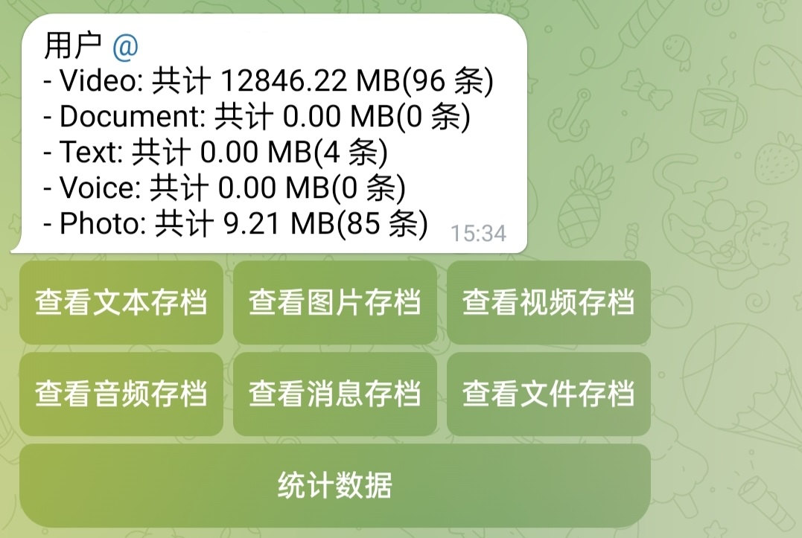

# Telegram 防撤回（归档）机器人

简体中文 | [English](./README-en.md)

一个防止消息被`撤回` / `失效`的 Telegram 机器人，可归档与便捷查询各种消息类型，支持恢复被删除的消息（通过上传），并配有简单的鉴权

## Notice

> 官方机器人 [API（本项目默认使用）](https://api.telegram.org/bot%s/%s) 仅支持上传`最大 50MB`，下载`最大20MB`的文件。若您有归档更大文件的需求，请使用自建 [telegram-bot-api](https://github.com/tdlib/telegram-bot-api) 服务器

## 介绍

### 支持归档的消息类型

- [x] 文本
- [x] 图片
- [x] 语音
- [x] 视频
- [x] 文件

### 功能展示
- 初始化
    
  

- 记录转发

  

- 查看归档数据（以 文本 类型记录为例）

  
    
  下方按钮从左到右依次为：上一页、帮助菜单、页面跳转（显示当前页）、下一页

- 查看统计数据

  

- 鉴权

  

### 工作原理

机器人在检测到[支持类型](#支持归档的消息类型)的转发消息后，会自动将文件下载到本地目录或保存到数据库（文本类型）。如果在查看归档记录时检测到文件ID失效，机器人会重新上传文件以实现防撤回的效果。

### 部署

1. 下载 [Release](https://github.com/IUnlimit/telegram-bot-disrecall/releases)
2. 通过 BotFather 创建你自己的机器人密匙（token）
3. 将 `token` 填入配置项 [`telegram-bot.token`](./configs/config.yml#L24)
4. 启动程序

### 配置文件

[config.yml](./configs/config.yml)
